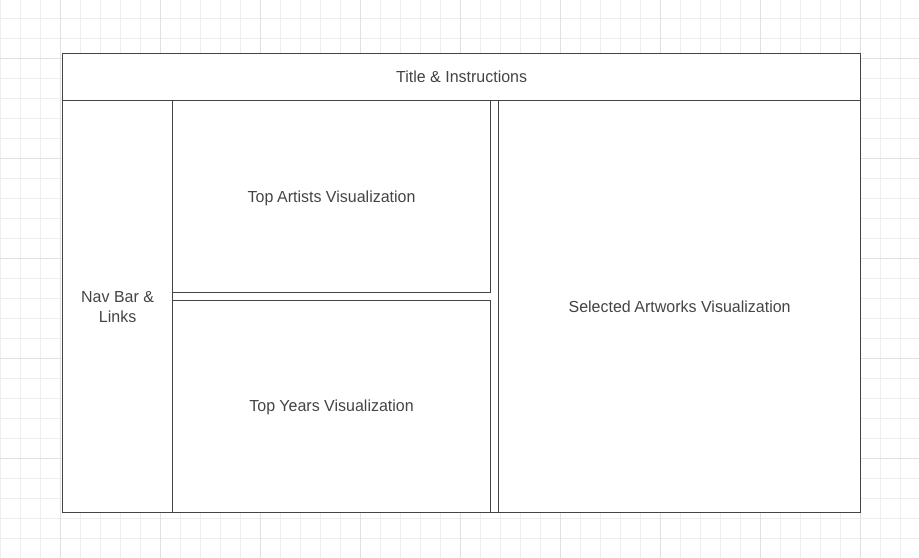

# TheMetHighlights_project

## Background

TheMetHighlights project is a data visualization of the artworks in The Metropolitan Museum of Art in New York City, providing a snapshot of different time periods in art history. The Met's collection is divided into 6 time periods, which can be selected and then explored by the user. For each time period, TheMetHighlights will show a snapshot which contains information on the share of highlights vs. non-highlights and the top named artists/attributors (by works produced) in each time period of the Met's collection, as well as show selected works. 

See it live here: [🎨 The Met Highlights](https://caroline495.github.io/The-Met-Highlights-Project/)

## Functionality & MVPs

In TheMetHighlights, users are able to:
- Choose between time period to explore via the nav bar showing the time periods available to select. Once selected, data visualizations specific for that time period will be reflected.
- Within each time period:
    - Look at the artists/attributors with most number of works attributed to them 
    - Look at a selected highlight that will have information such as artist, title, date, location, description

## Wireframe

 https://wireframe.cc/U6x5P3 

- Title & Instructions will display "TheMetHighlights" in HTML headings,  links to my Github and my LinkedIn, and some brief instructions.
- Nav Bar will have clickable time period links to switch the visualizations of the selected time period.
- The Share of Works, Top Artists, and Selected Artworks will display the data in dynamic renders.

## Technologies, Libraries, APIs

This project will utilize the following technologies:
- The Metropolitan Museum of Art's public API for the undeyling data: https://metmuseum.github.io/
- The `D3` API for data display visualizations
- `Webpack` and `Babel` to bundle and transpile the source JavaScript code
- `npm` to manage project dependencies

## Implementation Timeline

Subject to change:
- Thursday: Setup project, including getting webpack up and running. Get canvas to show up on the screen, and spend time getting comfortable with the Canvas API. Get comfortable with the Met's API to ensure my data is being fetched properly. 
- Friday & Weekend: Create View and TimePeriod classes. Work on getting the Top Artists, Years, and Selected Artworks visualizations to show up properly. Start working on the underlying logic of TheMetArtShare. 
- Monday: Dedicate this day toward implementing the underlying logic of TheMetArtShare. Ensure that data is being fetched correctly and appropriately. If time, make sure this is all rendered correctly on the canvas.
- Tuesday: Continue working on Top Artists, Years, and Selected Artworks visualizations to ensure they are rendered correctly on the canvas. Work on dynamic interactivity of the visualizations.
- Wednesday: Wrap up remaining tasks on visualizations and focus on styling, such as with the color schemes, styled nav bars, etc.
- Thursday Morning: Deploy to GitHub pages

## Future Features

- Implement search functionality that connects to the Met API to allow users to search for specific objects
- Add additional statistics to display for each time period at the Met
